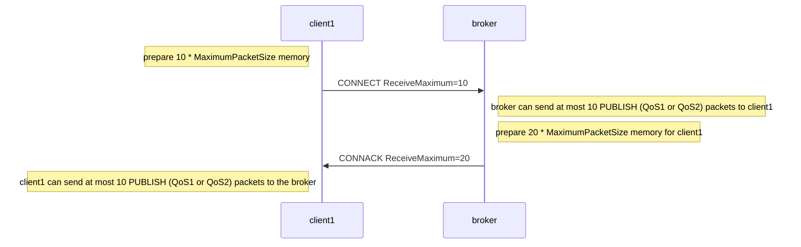

# Receive Maximum
Receive Maximum is a way to flow control PUBLISH(QoS1, QoS2) packets. They require to store for resending. So the node should prepare the memory packet size * Receive Maximum.
The maximum value of the packet size can be defined using [Maximum Packet Size](functionality/maximum_packet_size.md).

## Notifying Receive Maximum
There are two independent Receive Maximum. 

### broker to client Receive Maximum
The client can set `Receive Maximum` property that value is greater than 0 to the CONNECT packet. This means the client can receive the PUBLISH (QoS1 or QoS2) packet concurrently. If the sequence of publish is finished, 

Now writing...
