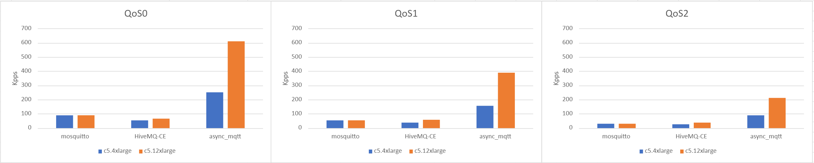

= Performance

I've measured how many publishes per second can async_mqtt broker treated.

== Environment

AWS EC2 c5.4xlarge, c5.12xlarge

- Benchmark targets
  - mosquitto version:2.0.11
  - hivemqt-ce-2023.4
  - async_mqtt 1.0.6

Single broker, multiple clients.
clients are genereted by https://github.com/redboltz/async_mqtt/tree/main/docker bench.sh

It publishes packets and receive it. Measure RTT(Round trip time).
Each clinet 100 publish/second (pps). Increase the number of clients until RTT over 1second.
For example, the number of client is 6,000, that means 600,000 (600K) pps.
Publish payload is 1024 bytes.

== Result

=== QoS0

|===
|ec2\broker|mosquitto|HiveMQ-CE|async_mqtt

|c5.4xlarge|90|53|250
|c5.12xlarge|90|66|610
|===

value is Kpps (Kilo publish per second)

=== QoS1

|===
|ec2\broker|mosquitto|HiveMQ-CE|async_mqtt

|c5.4xlarge|52|36|155
|c5.12xlarge|52|58|390
|===

value is Kpps (Kilo publish per second)

=== QoS2

|===
|ec2\broker|mosquitto|HiveMQ-CE|async_mqtt

|c5.4xlarge|28|24|89
|c5.12xlarge|28|38|210
|===

value is Kpps (Kilo publish per second)

